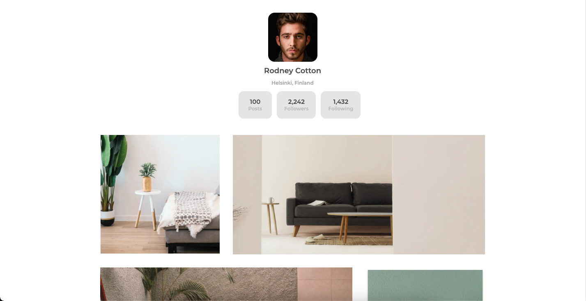

<h1 align="center">My Gallery</h1>

   Solution for a challenge from  <a href="http://devchallenges.io" target="_blank">Devchallenges.io</a>.

  <h3>
    <a href="http://ph-my-team-page.netlify.app/">
      Solution
    </a>
     | 
    <a href="https://devchallenges.io/challenges/gcbWLxG6wdennelX7b8I">
      Challenge
    </a>
  </h3>

<!-- TABLE OF CONTENTS -->

## Table of Contents

- [Table of Contents](#table-of-contents)
- [Overview](#overview)
  - [Built With](#built-with)
- [FEATURES](#features)
- [Acknowledgements](#acknowledgements)
- [Contact](#contact)

<!-- OVERVIEW -->

## Overview

### Built With

- HTML
- CSS
- Tailwind CSS

## FEATURES

This application/site was created as a submission to a DevChallenges challenge. The challenge was to build an application to complete the given user stories.

## Acknowledgements

- [Tailwind CSS](https://tailwindcss.com/)

## Contact

- GitHub [PaulosSouza](https://github.com/PaulosSouza)
- Twitter [Paulo H](https://twitter.com/@Souza13Paulo)